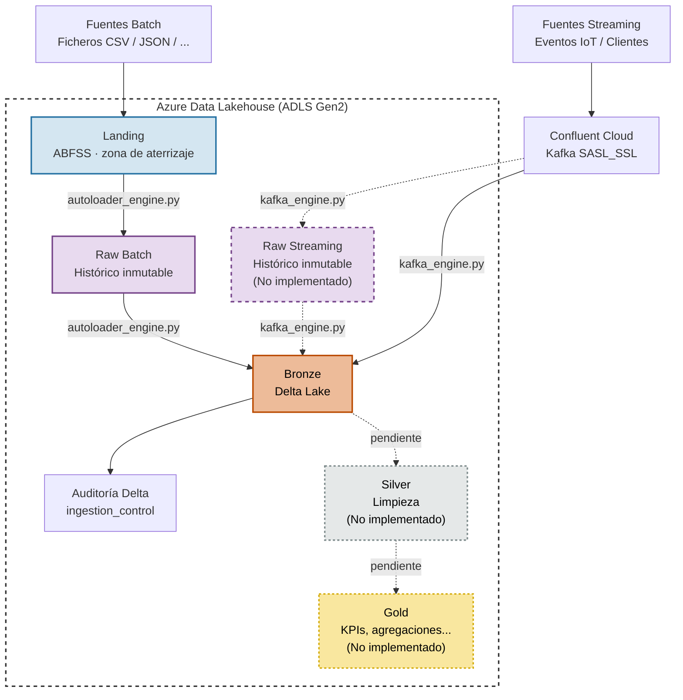

# FarmIA · Motor de Ingestas y Data Lakehouse

**Pablo Delgado García de Polavieja**  
**Septiembre 2026**

Proyecto de práctica para el Máster UCM Big Data & Data Engineering sobre diseño de ingestas y data lakehouses.

Este repositorio implementa un motor de ingesta **Batch** (Databricks Auto Loader / fallback PySpark) y **Streaming** (Apache Kafka vía Confluent Cloud) para FarmIA, una startup agrícola. El motor procesa datos de e-commerce, logística, inventario, meteorología, sensores IoT y eventos de clientes, operando con el mismo código fuente de forma agnóstica tanto en entorno **Local** como en **Azure Databricks**.

---

## Arquitectura

En el siguiente esquema se ilustra la arquitectura de datos del **Data Lakehouse de FarmIA** desplegado sobre Azure ADLS Gen2. Se detalla el flujo de ingesta de fuentes **Batch** (CSV/JSON) y **Streaming** (eventos IoT y de clientes a través de topics de Kafka en Confluent Cloud), así como la delimitación de las capas del modelo Medallion (Landing, Raw y Bronze) junto con la tabla de control de auditoría. Asimismo, se señalan las capas Silver, Gold y el archivado inmutable de streaming contemplados como evolutivos para el sistema.



El alcance actual del proyecto comprende las capas **Landing, Raw (batch) y Bronze**. Las capas **Raw (streaming)**, **Silver** y **Gold** se muestran como evolución futura de la arquitectura y no están implementadas en el presente proyecto.

### Capas del Lakehouse (Medallion Architecture)

| Capa | Ruta Local | Ruta Cloud (Azure ADLS Gen2) | Estado | Descripción |
|---|---|---|---|---|
| **Landing** | `data/landing/<dataset>/` | `abfss://farmia-data@<storage>/landing/` | Implementada | Ficheros raw depositados por las fuentes batch. |
| **Raw** | `data/raw/<dataset>/` | `abfss://farmia-data@<storage>/raw/` | Implementada (batch), Futura (streaming) | Archivado histórico de ficheros procesados en batch. |
| **Bronze** | `data/bronze/<dataset>/` | `abfss://farmia-data@<storage>/bronze/` | Implementada | Tablas Delta enriquecidas con metadatos técnicos. |
| **Silver** | — | — | Futura | Datos depurados, normalizados y transformados a partir de Bronze. |
| **Gold** | — | — | Futura | Agregaciones, KPIs y modelos orientados al consumo analítico. |
| **Checkpoints** | `data/checkpoints/<dataset>_checkpoint/` | `abfss://farmia-data@<storage>/checkpoints/` | Implementada | Gestión transaccional del estado del streaming. |

Todas las ingestas en la capa Bronze incorporan metadatos de trazabilidad:

- **Batch:** `_ingested_at`, `_ingested_filename`
- **Streaming:** `_ingested_at`, `_kafka_topic`, `_kafka_partition`, `_kafka_offset`

El control de auditoría se persiste de forma centralizada en la tabla Delta `ingestion_control`.

---

## Datasets

### Batch

| Dataset | Formato | Partición principal | Configuración |
|---|---|---|---|
| `ecommerce_ventas` | CSV | `fecha_pedido` | `config/batch/ecommerce_ventas.json` |
| `inventario_local` | JSON | `store_id` | `config/batch/inventario_local.json` |
| `logistica_envios` | CSV | `carrier` | `config/batch/logistica_envios.json` |
| `meteorologia` | CSV | `forecast_date` | `config/batch/meteorologia.json` |

### Streaming

| Dataset | Topic patrón | Partición principal | Configuración |
|---|---|---|---|
| `sensores_iot` | `farmia.iot.sensors.*` | `sensor_id` | `config/streaming/sensores_iot.json` |
| `eventos_clientes` | `farmia.events.customers.*` | `action` | `config/streaming/eventos_clientes.json` |

---

## Estructura del proyecto

```text
ingestas-lakehouses-tarea-final/
├── config/
│   ├── batch/
│   │   ├── ecommerce_ventas.json
│   │   ├── inventario_local.json
│   │   ├── logistica_envios.json
│   │   └── meteorologia.json
│   ├── streaming/
│   │   ├── eventos_clientes.json
│   │   └── sensores_iot.json
│   └── settings.py
├── notebooks/
│   ├── ingesta_batch.ipynb
│   └── ingesta_streaming.ipynb
├── scripts/
│   ├── generate_synthetic_data.py
│   ├── query_audit.py
│   ├── run_local_ingestion_batch.py
│   └── run_local_ingestion_streaming.py
├── src/
│   ├── batch/
│   │   ├── __init__.py
│   │   └── autoloader_engine.py
│   ├── common/
│   │   ├── __init__.py
│   │   ├── audit.py
│   │   ├── audit_listener.py
│   │   ├── logger.py
│   │   └── spark.py
│   └── streaming/
│       ├── __init__.py
│       └── kafka_engine.py
├── tests/
│   ├── __init__.py
│   ├── conftest.py
│   └── test_batch_ingestion.py
├── .env.example
├── .gitignore
├── README.md
└── requirements.txt
```

---
### 📋 Requisito previo: configuración de Confluent Cloud

Antes de ejecutar el motor, tanto en **local** como en **Azure Databricks**, es necesario disponer de una instancia activa de **Confluent Cloud**.

Aunque el proyecto podría haberse implementado utilizando un broker local de Kafka mediante Docker, se ha optado por utilizar **Confluent Cloud como proveedor gestionado en ambos entornos**. De este modo, se mantiene una arquitectura más próxima a un escenario real de producción y se simplifica la configuración del despliegue híbrido.

#### 1. Creación del clúster y los topics

Crea un clúster en Confluent Cloud y define los siguientes dos topics, utilizando la configuración de particiones por defecto:

* `farmia.events.customers`
* `farmia.iot.sensors`

#### 2. Generación de API Key y permisos (ACLs)

Crea una **API Key** en Confluent Cloud para la autenticación del motor de ingesta y asigna los permisos mínimos necesarios para trabajar con los topics.

**Configuración de ACLs para los topics:**

| Topic Name                | Permission | Operation | Pattern Type |
| ------------------------- | ---------- | --------- | ------------ |
| `farmia.events.customers` | **ALLOW**  | **READ**  | `PREFIXED`   |
| `farmia.events.customers` | **ALLOW**  | **WRITE** | `PREFIXED`   |
| `farmia.iot.sensors`      | **ALLOW**  | **READ**  | `PREFIXED`   |
| `farmia.iot.sensors`      | **ALLOW**  | **WRITE** | `PREFIXED`   |

> **Nota:** La operación `WRITE` es necesaria para que `generate_synthetic_data.py` pueda publicar eventos sintéticos en Confluent Cloud, mientras que `READ` es utilizada por `kafka_engine.py` para consumir los eventos durante la ingesta Streaming.

### 💻 Nota sobre los entornos de ejecución

La tarea exige la integración y ejecución en **Azure Databricks**. Como ampliación, el motor se ha diseñado para permitir también su **ejecución completa en local mediante PySpark**.

Esto facilita el desarrollo, la depuración y la ejecución de pruebas automatizadas, evitando depender continuamente de la disponibilidad de un clúster de Databricks y permitiendo validar el funcionamiento del motor antes de desplegarlo en cloud.

A continuación se detallan las instrucciones paso a paso para ambos escenarios:

1. Ejecución local con PySpark
2. Despliegue y ejecución en Azure Databricks

---


## Guía de ejecución local

### 1. Configuración del entorno virtual y dependencias

Crear y activar el entorno virtual e instalar las dependencias necesarias:

```bash
# Crear entorno virtual
python -m venv .venv

# Activar entorno virtual
# En Linux/macOS:
source .venv/bin/activate

# En Windows (PowerShell):
.venv\Scripts\activate

# Instalar dependencias
pip install -r requirements.txt
```

### 2. Variables de entorno (`.env`)

Copia el fichero `.env.example` y crea un archivo `.env` en la raíz del proyecto para la ejecución local con las credenciales de Confluent Cloud y las rutas locales:

```ini
ENVIRONMENT=local

BASE_LANDING_PATH=data/landing
BASE_RAW_PATH=data/raw
BASE_BRONZE_PATH=data/bronze
BASE_CHECKPOINT_PATH=data/checkpoints

CONFLUENT_BOOTSTRAP_SERVER=pkc-xxxx.region.azure.confluent.cloud:9092
CONFLUENT_API_KEY=TU_API_KEY
CONFLUENT_API_SECRET=TU_API_SECRET
```

> **Nota:** Las credenciales reales no deben incluirse en el repositorio. El archivo `.env` debe estar incluido en `.gitignore`.

### 3. Generar datos sintéticos

El generador sintético permite crear datos de forma modular o completa mediante el parámetro `mode`:

```bash
# Generar todo (archivos Batch en Landing + eventos Streaming en Confluent Kafka)
python scripts/generate_synthetic_data.py all

# Generar únicamente archivos Batch en la carpeta Landing
python scripts/generate_synthetic_data.py batch

# Publicar únicamente eventos Streaming hacia Confluent Cloud Kafka
python scripts/generate_synthetic_data.py streaming
```

### 4. Ejecutar los motores de ingesta

#### Ingesta Batch completa

Lanza el runner local que limpia datos, genera los archivos de Landing y procesa todos los datasets Batch:

```bash
python scripts/run_local_ingestion_batch.py
```

También se puede invocar el motor individualmente por dataset:

```bash
python src/batch/autoloader_engine.py ecommerce_ventas.json
python src/batch/autoloader_engine.py inventario_local.json
python src/batch/autoloader_engine.py logistica_envios.json
python src/batch/autoloader_engine.py meteorologia.json
```

#### Ingesta Streaming (Kafka Confluent Cloud)

Lanza el runner local que procesa todos los datasets Streaming configurados:

```bash
python scripts/run_local_ingestion_streaming.py
```

También se puede invocar el motor individualmente por dataset:

```bash
python src/streaming/kafka_engine.py eventos_clientes.json
python src/streaming/kafka_engine.py sensores_iot.json
```

### 5. Consultar la auditoría de ingesta

La tabla de auditoría puede consultarse bajo demanda mediante el script `query_audit.py`:

```bash
python scripts/query_audit.py
```

Este script permite consultar los registros generados en la tabla `ingestion_control` y comprobar el estado y las métricas de las ingestas ejecutadas.

---

## Guía de despliegue en Databricks

### 1. Importar el repositorio

En Databricks, ve a **Workspace → Repos**, haz clic en **Add Repo** y clona el proyecto desde la URL: [https://github.com/pdelgadogp/masterucm-farmia-lakehouse](https://github.com/pdelgadogp/masterucm-farmia-lakehouse) (repositorio público).

### 2. Crear el container en Azure Storage

Antes de configurar el clúster, es necesario disponer de una cuenta de **Azure Data Lake Storage Gen2** con un container llamado:

```text
farmia-data
```

Este container será utilizado como raíz del Data Lakehouse para almacenar las diferentes capas y los checkpoints del sistema:

```text
farmia-data/
├── landing/
├── raw/
├── bronze/
└── checkpoints/
```

Las rutas utilizadas por el proyecto siguen el formato **ABFSS**:

```text
abfss://farmia-data@<storage>.dfs.core.windows.net/<ruta>
```

Por tanto, el nombre del container debe ser exactamente `farmia-data`, salvo que se modifiquen las rutas y la configuración del proyecto.

### 3. Configurar el clúster

Para la ejecución del proyecto en Azure Databricks se ha utilizado el siguiente clúster:

* **Databricks Runtime:** `19` (incluye **Apache Spark 4.2.0** y **Scala 2.13**).
* **Tipo de nodo:** `Standard_D4ds_v4`.
* **Recursos:** **16 GB de memoria** y **4 núcleos**.

En la configuración del clúster de Databricks, ve a **Advanced Options → Spark** y añade las propiedades de Azure Data Lake Storage (ADLS Gen2) junto con las credenciales de Confluent Cloud:

```ini
# Rutas base del Lakehouse (ABFSS)
spark.farmia.base_landing_path=abfss://farmia-data@<storage>.dfs.core.windows.net/landing
spark.farmia.base_raw_path=abfss://farmia-data@<storage>.dfs.core.windows.net/raw
spark.farmia.base_bronze_path=abfss://farmia-data@<storage>.dfs.core.windows.net/bronze
spark.farmia.base_checkpoint_path=abfss://farmia-data@<storage>.dfs.core.windows.net/checkpoints

# Acceso a Azure Storage Container
adls.account.name=<storage>
fs.azure.account.key.<storage>.dfs.core.windows.net=<storage_account_key>

# Credenciales de Confluent Cloud
spark.env.CONFLUENT_BOOTSTRAP_SERVER=pkc-xxxx.region.azure.confluent.cloud:9092
spark.env.CONFLUENT_API_KEY=<TU_API_KEY>
spark.env.CONFLUENT_API_SECRET=<TU_API_SECRET>
```

### 4. Ejecución desde notebooks

En **Azure Databricks**, ejecuta directamente los notebooks preparados en el repositorio:

* **Ingesta Batch:** `notebooks/ingesta_batch`
* **Ingesta Streaming:** `notebooks/ingesta_streaming`

Estos notebooks contienen la configuración y las llamadas necesarias para ejecutar los respectivos motores de ingesta en el entorno de Databricks.

---

## Añadidos extra y mejoras adicionales

Este proyecto incorpora patrones adicionales orientados a un escenario más cercano a producción.

### 1. Despliegue híbrido y ejecución local agnóstica

* **Doble motor de ejecución:** el motor puede ejecutarse en **Local (PySpark)** y en **Azure Databricks** utilizando el mismo código fuente.
* **Auto-detección de entorno (`_is_cloud`):** detección dinámica para alternar entre el sistema de archivos local (`data/`) y Azure Data Lake Storage Gen2 (`abfss://`).

### 2. Integración real con Confluent Cloud

* **Seguridad gestionada:** el motor conecta con un clúster real de Confluent Cloud mediante cifrado y autenticación `SASL_SSL`.
* **Control de acceso granular (ACLs)**: permisos restringidos por prefijo a nivel de tópicos, consumidores y transacciones.
* **Consumo resiliente**: lectura incremental con checkpointing persistente para garantizar procesamiento exactly-once y tolerancia a fallos.

### 3. Sistema de auditoría y control de ingesta

* **Persistencia en Delta Lake:** creación de una tabla Delta centralizada (`ingestion_control`) donde se registran las métricas de cada lote procesado.
* **Trazabilidad:** captura síncrona y mediante `StreamingQueryListener` de métricas clave:

  * `pipeline_name`
  * `source_name`
  * `batch_id`
  * `ingest_ts`
  * `rows_read`
  * `rows_written`
  * `status` (`SUCCESS` / `FAILURE`)
  * `notes`

### 4. Gestor de trazabilidad e ingeniería de logs (`logger.py`)

* **Sistema centralizado de trazabilidad:** abstracción modular de logging que estandariza las salidas por consola y archivo con marcas de tiempo (`timestamps`), niveles de severidad (`INFO`, `WARN`, `ERROR`) y contexto del módulo emisor.
* **Formateo desacoplado de Spark:** permite trazar el ciclo de vida de los procesos (inicializaciones, *fallbacks* de variables de entorno y cierres de micro-lotes) sin saturar la consola con la verbosidad por defecto de la JVM de Spark.

### 5. Generador de datos sintéticos modular

* **Generación bajo demanda:** el script `generate_synthetic_data.py` permite parametrizar la creación de datos (`all`, `batch`, `streaming`) desde la terminal o importándolo como librería en notebooks de Databricks.
* **Fallback de escritura:** capacidad de escribir en disco local mediante `io.StringIO` o directamente en ADLS Gen2 mediante `dbutils.fs.put`, según el contexto activo.

### 6. Robustez en el manejo de credenciales y rutas

* **Patrón *fallback* para credenciales:** lectura prioritaria de `.env` en local con caída automática a `spark.conf` en Databricks, evitando *hardcodear* secretos en el código.
* **Gestión de checkpoints en ABFSS:** configuración explícita de `checkpointLocation` sobre almacenamiento persistente en la nube para permitir la recuperación del estado del *streaming* ante fallos.


---

## Futuras mejoras

El proyecto cubre el alcance mínimo exigido (Landing, Raw batch, Bronze) más algunos añadidos de robustez, pero deja deliberadamente fuera una serie de mejoras evolutivas por simplificar el desarrollo y el despliegue durante la práctica. Se documentan aquí como posible roadmap:

### Arquitectura de datos

* **Capas Silver y Gold:** implementación de las transformaciones de calidad/limpieza (Silver) y las agregaciones/KPIs orientadas a consumo analítico (Gold), actualmente fuera de alcance.
* **Raw Streaming (archivado en frío):** persistir el payload crudo de Kafka (sin parsear, junto con `_kafka_topic`, `_kafka_partition`, `_kafka_offset`) antes de su escritura en Bronze. Esto permite reprocesar eventos más allá de la ventana de retención del topic en Confluent Cloud, desacoplando el replay de la política de retención del broker.

### Orquestación y despliegue

* **Despliegue automatizado con Databricks Asset Bundles (DAB):** sustituir la importación manual del repo vía Workspace → Repos por un despliegue declarativo (`databricks.yml`) que gestione clúster, jobs y permisos como código, integrable en CI/CD.
* **Jobs programados en Databricks:** creación de un job por pipeline (batch y streaming) con triggers horarios o bajo demanda. Para streaming, aprovechar que el motor ya usa `availableNow=True` en lugar de un stream continuo (`processingTime` always-on). Esto permite ejecutarlo como un job programado (p. ej. cada hora) que arranca, procesa el backlog disponible en Kafka y termina, en vez de mantener un clúster activo 24/7 solo para consumir eventos.

### Seguridad y gobierno de datos

* **Migración de credenciales a Databricks Secrets API:** las credenciales de Confluent Cloud y la storage account key están actualmente en la configuración de Spark del clúster (`spark.env.*`, `fs.azure.account.key.*`) por simplicidad. Deberían moverse a *secret scopes* y referenciarse vía `dbutils.secrets.get()`, evitando texto plano visible para cualquiera con acceso a la config del clúster.
* **Migración a Unity Catalog:** el proyecto usa actualmente Hive Metastore (legacy). Migrar a Unity Catalog aportaría control de acceso a nivel de fila/columna, linaje automático entre capas del lakehouse, auditoría centralizada de accesos y gestión unificada de credenciales de storage (*storage credentials* / *external locations*) en lugar de claves embebidas en la config del clúster — quedando además alineado con el sentido de deprecación de Hive Metastore por parte de Databricks.

---

## Tests

La suite de tests se ejecuta en local con **PySpark** y **Delta Lake**, e incluye:

* **Tests unitarios**: motores, sesión Spark, logger, auditoría y validación de configuraciones, utilizando mocks cuando es necesario.
* **Tests de integración**: ingesta Batch, orquestador Batch y Streaming sobre una sesión Spark real.

### Ejecución de la suite

Para ejecutar la suite completa con reporte de cobertura:

```bash
pytest tests/ --cov=src --cov-report=term-missing ; python -m coverage combine ; python -m coverage report
```

La suite busca cubrir los componentes y flujos principales del proyecto. No se persigue alcanzar el 100 % de cobertura de código por motivos de practicidad y tiempo (aunque la cobertura queda a más del 90%). Se prioriza una cobertura suficiente de la funcionalidad crítica y de los principales escenarios de ejecución.
